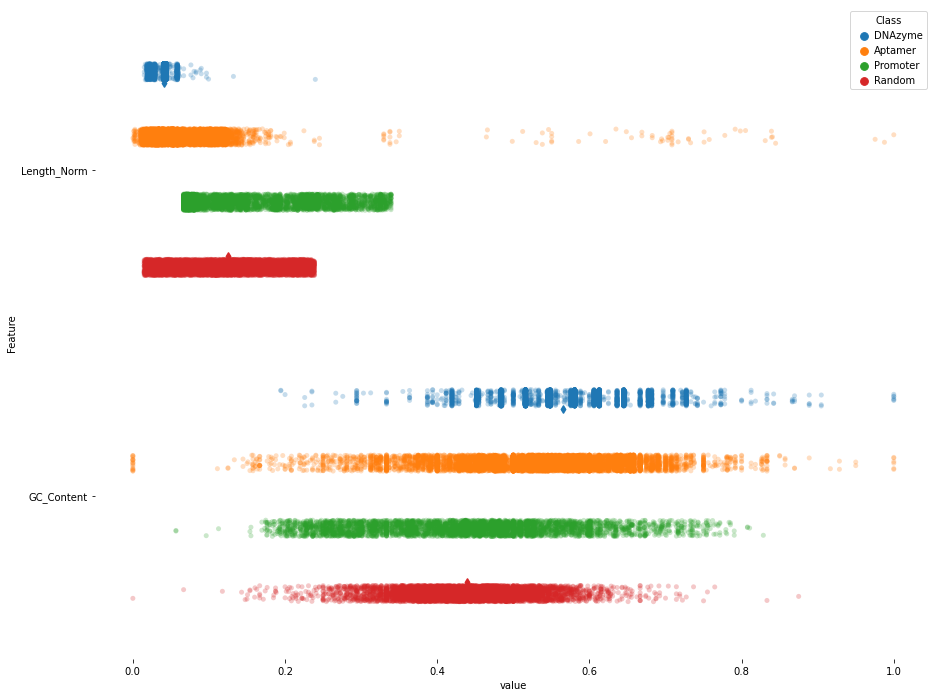

SELEXzyme: Generating DNAzymes for Target Sequences using a Genetic Algorithm
=============================================================================

[Demo](./demo.mp4)

# Table of Contents
- [Project Overview](#Project-Overview)
- [Usage](#Usage)
  - [Installation](#Installation)
  - [Commands](#Commands)
  - [External Dependencies](#External-Dependencies)
    - [Python](#Python)
    - [Golang](#Golang)
- [Genetic Algorithm](#Genetic-Algorithm)
  - [Breeding](#Breeding)
    - [Crossover](#Crossover)
    - [Mutation](#Mutation)
  - [Halting](#Halting)
  - [Fitness Function](#Fitness-Function)
    - [Complementarity To Target](#Complementarity-To-Target)
    - [Catalytic Activity](#Catalytic-Activity)
- [DNAzyme Classification Model](#DNAzyme-Classification-Model)
  - [Data Collection](#Data-Collection)
  - [Training](#Training/Algorithms)
- [Empirical Validation](#Empirical-Validation)

# Project Overview
This project implements a genetic algorithm to evolve a set of DNAzymes that will target a user-supplied DNA sequence for cleavage.
It will generate a random pool of DNAzymes (DNA sequences) and breed (defined [here](#Breeding)) the best members to create a new pool of sequences.
It will repeat until there is no significant fitness improvement or it reaches the specified maximum number of iterations
Here best is defined as those sequences that maximized our [fitness function](#fitness-function).
The final generation of DNAzymes represent the best DNAzymes the algorithm has seen over all generations.
This generation will be written to a fasta or tsv file.

# Usage

## Installation
First you can clone and enter the git repository in your Golang Path
```
git clone https://github.com/DJSiddharthVader/SELEXzyme && cd SELEXzyme
```
Next you can install the python dependencies with
```
conda env create -f environment.yml
conda activate selexzyme
```
You also want to set the python path in the [fitness.go](https://github.com/DJSiddharthVader/Project_02601/blob/a41de1722939d9133786d7f24ecad820c12c4226/genetic_algorithm/fitness.go#L15) file so Golang knows where to find your python3 exe.
Next you can install the Golang dependencies
```
go get github.com/biogo/biogo
go get github.com/cheggaaa/pb
```
Now you can build the program with
```
cd genetic_algorithm && go build .
```
now the executable can be used as
```
./genetic_algorithm -h
```
you must run from inside the `./genetic_algorithm` directory.

## Commands
You can refer to the [demo video](./demo.mp4) as well, running the program is

```
./genetic_algorithm -target   $target.fna
                    -model    $model.pickle
                    -output   $output.fna
                    -maxIters $num_gens
```

The arguments are
 - `$target.fasta` fasta file where the first entry is the sequence you want the DNAzyme to target
 - `$model_file` pickle file with parameters for model making the DNAzyme prediction
 - `$output.fna` output file containing a population of DNAzyme sequences
   - can output tsv or fasta file, automatically detected from extension
   - fasta includes sequence label and fitness in headers
   - tsv include columns:
     - __sequence:__ the DNAzyme sequence
     - __id:__ unique identifier for this sequence
     - __fitness:__ total fitness score as described [here](#fitness-function)
 - `$num_gens` maximum number of generations to simulate if fitness does not plateau before

There are other adjustable parameters, run `./genetic_algorithm -h` to see a list of all arguments and defaults.

If you run
```
./genetic_algorithm -target ../data/examples/target.fna -output ../data/examples/dnazymes.fna -seed 9
```
then the file `./data/examples/dnazymes.fna` should be identical to `./data/examples/dnazymes_true.fna`.
The following should also be printed to console
```
Reached Fitness Plateau at generation  19
Final Generation Fitness Summary
-------------------------------------
Min.............. 0.1
25% Quart         0.46
Mean............. 0.45211800094783916
75% Quart         0.46
Max.............. 0.46
Std. Dev          0.04861923289688608
CoV.............. 0.10753660061081106
-------------------------------------
```

## External Dependencies

### Python
A environment.yml is included for installing python dependencies with conda
- numpy      (useful for numeric transformation)
- pandas     (data processing)
- sklearn    (train, validate ML models)
- pickle     (for saving/loading trained models)
- matplotlib (plotting)
- seaborn    (plotting)

### Golang
- github.com/biogo/biogo (for fasta utilities)
- github.com/cheggaaa/pb (progress bar)

# Genetic Algorithm

## Breeding
The crux of a genetic algorithm is breeding a new population of solutions from a current population of solutions to increase the overall fitness.
This way after a number of iterations we will have a much fitter population than the initial population.
In our case a solution is an actual DNA string representing a DNAzyme that will specifically bind our user-specified target sequence.
So given a population of solutions  we first take the fittest members of the population  (default top 20%) and use them to breed a new population .
Breeding here essentially means crossover and mutate to create a new solution.
So we randomly select two solutions  (with replacement)  and create a new solution


We continue generating 's until our new population is the same size as our current population 


Note that  is passed on to the new population as these are still our best solutions so far.

### Crossover
Crossover is a key element of genetic algorithms.
Crossover helps ensure that new solutions are created during each generation while retaining the best features from the current set of solutions.
It is done by taking parts of two different solutions and gluing them together to form a new solution.
In this case our solutions are actual genetic sequences so the process is fairly trivial.
First we select a random index i and then merge two sequences as such

taking the first part of  and the second part of .

### Mutation
Again mutation is implemented to introduce more variation into the solution population, specifically to avoid getting stuck in local optima.
For mutation every base in a sequence is mutated with some probability  (default 0.005).
This is done to more closely mimic actual models of DNA mutation, as opposed to mutating a set percentage of bases for each sequence.
Further there is a chance (default 0.1) that a given mutation can result in an insertion or deletion (each 0.5 probability).
In a deletion that base is deleted from the solution, in an insertion a new random base is added after the current base, which is left unchanged.
Mutations must change the base to a new base, so you cannot have a  mutation.

## Halting
At some point the program must halt and cease to produce new generations of solutions.
This is done in two cases; reaching the max number of iterations (default 30) or no increases in population fitness.
This is an optimization algorithm so eventually it will reach a fitness optimum and no longer be able to improve its solutions.
To asses this we first calculate the average fitness of all solutions for each generation separately.
Next we check if the coefficient of variation (std.dev / mean) of the previous  generations (default 5) is less than some threshold  (default 0.25)
This means that the average fitness has not changed much in the past  generations and thus further generations will not change the average fitness enough.
This is the default option but you can also specify to just consider if the CoV of fitness from the current generation is below a threshold.

## Fitness Function
The fitness function considers the "DNAzyme-ness" of a sequence and how similar it is to the complement of the target.
Complementarity to the target measure how likely the DNAzyme will bind to the target.
The "DNAzme-ness" evaluation is done with a machine learning model trained as a binary classifier for the labels "DNAzyme" and "Not DNAzyme" described [here](#machine-learning-dnazyme-classification-model).
These are weighted (arbitrarily) as 0.4 weight for complementarity and 0.6 weight for DNAzyme-ness.

### Complementarity To Target
The complementarity to the target sequence is also considered when assessing sequence fitness, specifically


is what is calculated.
The Smith-Waterman local alignment score is calculated between the current DNAzyme and the target sequence.
We use Smith-Waterman because only part of the DNAzyme needs to match the target and the DNAzymes are likely larger than the target regions.
This is the raw score, counting mismatches and gaps according to the scoring matrix defined [here](./genetic_algorithm/data.go).
This score is then divided by the length of the target, ensuring that the maximum score is always 1, for a perfect matching sequence.
Note we are measuring the normalized Smith-Waterman score to the complement of the target sequence because we want it to bind the target.

### Catalytic Activity
We use a machine learning model to estimate the "DNAzyme-ness" (general catalytic activity) of given DNA sequence, see [here](#machine-learning-dnazyme-classification-model)
The actual value is the probability that the given sequence is a DNAzyme according to the ML model

# DNAzyme Classification Model

## Data Collection
Data is required for training the machine learning model to asses how likely a given DNA sequence is a DNAzyme.
There are relatively few known DNAzyme sequence so we also want to include negative examples, which include random DNA sequences and aptamer like sequences that can bind proteins but have no catalytic activity.
Known DNAzymes, DNA Aptamers and promoters were downloaded from the [NCBI Nucleotide](https://www.ncbi.nlm.nih.gov/nuccore/), by searching for "DNAzyme","Aptamer" and "promoter" respectively and filtering for "genomic DNA/RNA".
Promoters were constrained to be between 50-250 base pairs long to trim the results and more closely resemble Aptamers and DNAzymes
Random sequences between 10-100bp with GC% matching the real DNAzymes were also generated as negative training examples.
A tsv including all the sequences and labels is provided in `./data/All_sequences.tsv`, which contains
 - 9999 Aptamers
 - 5581 DNAzymes
 - 4537 Promoters
 - 6706 Random sequences

An example of the data is viewable [here](./data/example_training_data.tsv)
(Note values the `Identifier_Type` column are described [here](https://en.wikipedia.org/wiki/FASTA_format#NCBI_identifiers).

## Training
Based on a brief literature search it seems like Support Vector Machines (SVMs) are effective and reliable for DNA sequence classification.
SVMs are also relatively simple (few parameters) and implemented effectively in packages like sklearn, making them relatively easy to use.
Due to the amount of training data and my limited access to resources I could not actually use the sklearn SVM as it could not store the data in memory at once.
So I instead used the sklearn `SGDClassifier` which allows for incremental training
The SGD with the "modified_huber" loss function is equivalent to an SVM with a linear kernel function according to sklearn so this was the actual model used.
The code for training the SGD is in the ipython notebook [here](./dnazyme_ML_model/training_dnazyme_model.ipynb).

First the string sequences must be transformed into numeric vectors for training.
So each DNAzyme is split into a bag of k-mers (k=6, chosen arbitrarily) and then into a frequency vector of k-mers.
Since k=6 there are  unique 6-mers so our frequency vector for a sequence is of length 4096 where the value in each element is the number of occurrences of that specific 6-mer divided by the total number of 6-mers in the sequence.
You can essentially think of it as a 6-mer frequency table for the sequence.
The labels for each sequence are binary so 0 if the sequence is not a DNAzyme and 1 if it is.
So the 6-mer frequency table and label for each sequence is our training data.

The training set was 70% of the data, the test set was 15% of the data (for hyperparameter tuning) and the validation set was 10% of the data, reserved for a final validation once the hyperparameters were tuned.
This split was decided to try and reduce over-fitting, that the model will generalize to new sequences not in the training data.
Unfortunately the model was grossly over-fit to the data resulting in the following scores on the test set without any tuning
```
accuracy:   0.9924953095684803
precision:  0.9925285010448603
recall:     0.9924953095684803

Confusion Matrix
Predicted     0    1
Actual
0          2032    2
1            18  613
```
After some further investigation of the training data it appears that the DNAzymes are generally much shorter than the negative examples, perhaps tricking the model to just use length as a proxy for DNAzyme-ness.

Also the DNAzyme sequences were clustered, with sets from the same experiment designed to target the same gene.
This artificially increased the similarity of the DNAzymes and put heavy importance on specific k-mers that were important for that experiment by not for general DNAzyme-ness.
This bias is compounded by how short the sequences were and the very few sources of DNAzymes creating a highly over-fit model due to the artificial similarity of all the DNAzyme sequences.
At this point it appeared pointless to actually tune the hyperparameters due to how poor the DNAzyme data and due to time/data constraints I abandoned any further development of the model and used what I had.

# Empirical Validation
Ideally this project would provide a computational alternative to how DNAzymes might normally be optimized involving techniques like SELEX.
SELEX functions very well but it can be laborious and expensive and difficult to decide on some model parameters before starting.
Using a computational method will save significant amounts of time and resources, as well as allowing researchers to more easily experiment with simulation parameters.
So if a researcher can approximate a SELEX result with a simulated result that would be very beneficial and open up the use of DNAzymes (or potentially DNA Aptamers) for more research applications.

In order to do this I want to compare the output of SELEXzyme to that of a set of DNAzymes evolved _in vitro_ as done by the researchers Abdelgany et al. in their paper [Design of efficient DNAzymes against muscle AChR alpha-subunit cRNA in vitro and in HEK 293 cells](https://pubmed.ncbi.nlm.nih.gov/19771209/)
They did not preform SELEX but they did preform an assay testing the cleavage efficiency of thier DNAzymes to select the most effective ones.
So if my program works well it should ideally
- output some DNAzymes similar to the best ones Abdelgany et al. identified
- score the fitness of the Abdelgany et al. DNAzymes similarly to their assay results

So the fitness rankings of the Abdelgany DNAzymes should be similar based on their assay results and my fitness function.
It is also possible that my program outputs no DNAzymes similar to the Abdelgany ones but still effective DNAzymes

The DNAzymes were taken from Table 1 from the Abdelgany paper (note, they show the targeted RNA sequence so I take the complement DNA for fitness evaluation).
The sequence for their DNAzyme target, AchR -subunit, was obtained from NCBI Gene [here](https://www.ncbi.nlm.nih.gov/CCDS/CcdsBrowse.cgi?REQUEST=CCDS&GO=MainBrowse&DATA=CCDS2261.1).

The authors do not provide comprehensive fitness data, the most reliable fitness information they provided was that the DNAzymes followed a clear hierarchy of cleavage efficiency depending on the cleavage site (e.g. GT for 463GT(10+10)) which is  GC >>> AC">.

We can rank the DNAzymes by fitness determined by my program and see if they follow this pattern.

Using my model and the target gene cRNA my program calculated the following fitness values
DNAzyme | Fitness
--------|--------
463GT(10+10) | 0.2
463GT(13+9) | 0.2
463GT(9+13) | 0.2
472AT(10+10) | 0.18095238095238098
472AT(13+9) | 0.1826086956521739
472AT(9+13) | 0.1826086956521739
476AC(10+10) | 0.19047619047619047
685AC(13+9) | 0.16521739130434784
694GT(13+9) | 0.2
696AT(13+9) | 0.2
765GT(13+9) | 0.2
765GT(9+13) | 0.2
799AC(13+9) | 0.18517395695217392
801GT(13+9) | 0.1826086956521739
801GT(9+13) | 0.1826086956521739
805AT(13+9) | 0.1826086956521739
808GC(13+9) | 0.1826086956521739
811GT(10+10) | 0.18095238095238098
811GT(13+9) | 0.1826086956521739
811GT(9+13) | 0.1826086956521739
811GT(13+13) | 0.1851851851851852

So based on these fitness values they do seem to conform to our hierarchy with the exceptions of 696AT(13+9), 476AC(10+10), 799AC(13+9) which are considered more fit than they should be.
Based on how overfit the DNAzyme model was this was somewhat surprising but is still not a particularly impressive result.


The full set of evolved DNAzymes from my program are [here](./data/validation/my_dnazymes.fna) but this is the fitness summary, all default parameters except `-lower 15` were used.
```
Reached Fitness Plateau at generation  29
Final Generation Fitness Summary
-------------------------------------
Min.............. 0.15789473684210528
25% Quart         0.4789473684210526
Mean............. 0.4690277651388846
75% Quart         0.4789473684210526
Max.............. 0.4789473684210526
Std. Dev          0.04608867794884832
CoV.............. 0.09826428491968045
-------------------------------------
```
Qualitatively my DNAzymes are generally about half the length of the Abdelgany DNAzymes and contain much fewer C's, so they do appear to be fairly distinct.
Since these researchers have _in vivo_ validation for their DNAzymes it appears that my model is not particularly effective, especially since it is biasing to make sequences as short as possible due to how the DNAzyme model was trained.
However after increasing the lower bound from 10 to 15 results in a DNAzyme pool that look more similar to the Abdelgany DNAzymes and with a similar fitness distribution.
There is also larger redundancy in the final output as many of the sequences (the most fit) are identical and have identical fitness values.
